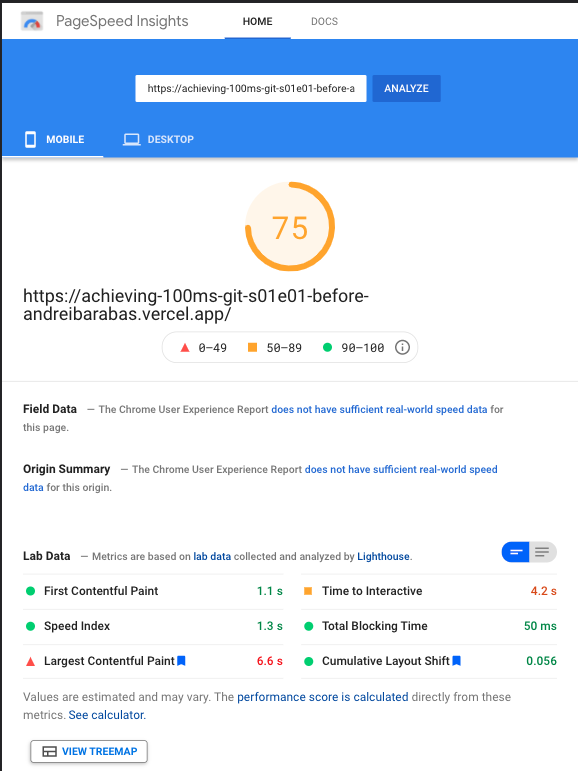
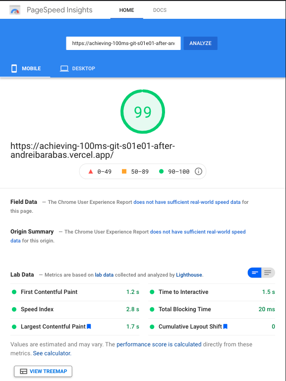

## S1.E1

# How to speed up your website 2.5x times by using responsive images

## Tips & Tricks

Instead of using the regular `` tag, also specify a set of variants using the `srcset` attribute so that the browser can pick the correct version based on the device type and screen size.

```

```

Pretty straight forward. It's a little bit of work to prepare upfront all the image variants, but as you can see in the Results, the `2.5x speed increase` is worth it.

[See code](https://github.com/andreibarabas/achieving-100ms/compare/S01.E01-before...S01.E01-after)

# Benchmarks

| Before optimization                                                                                                                                 | After optimization                                                                                                                                 |
| --------------------------------------------------------------------------------------------------------------------------------------------------- | -------------------------------------------------------------------------------------------------------------------------------------------------- |
| [Demo](https://achieving-100ms-git-s01e01-before-andreibarabas.vercel.app)                                                                          | [Demo](https://achieving-100ms-git-s01e01-after-andreibarabas.vercel.app)                                                                          |
| Time to Interactive: `4.2s`                                                                                                                         | Time to Interactive: `1.5s (~2.8x speed increase)`                                                                                                 |
|                                                                                                                        |                                                                                                                         |
| [See more](https://developers.google.com/speed/pagespeed/insights/?url=https%3A%2F%2Fachieving-100ms-git-s01e01-before-andreibarabas.vercel.app%2F) | [See more](https://developers.google.com/speed/pagespeed/insights/?url=https%3A%2F%2Fachieving-100ms-git-s01e01-after-andreibarabas.vercel.app%2F) |
